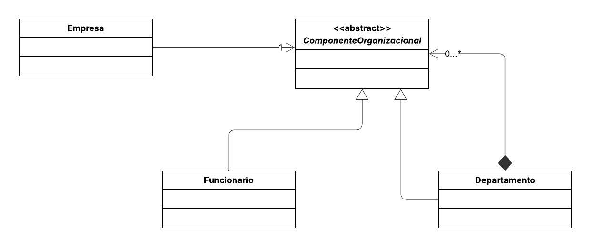

## 🏢 Sistema de Estrutura Organizacional com Padrão Composite

Este projeto implementa o **Padrão de Projeto Estrutural Composite**.

O objetivo é simular a construção de estruturas de dados hierárquicas, como a **estrutura organizacional** de uma empresa, permitindo que o cliente (a classe `Empresa`) trate objetos individuais (`Funcionario`) e composições de objetos (`Departamento`) de forma uniforme.

O "esqueleto" de operações é definido na classe abstrata `ComponenteOrganizacional` (com o método comum `getEstrutura()`), e tanto a folha (`Funcionario`) quanto o contêiner (`Departamento`) a implementam. O contêiner (`Departamento`) utiliza a recursão para percorrer todos os seus componentes internos e construir o resultado final.

---

## 📌 Diagrama de Classes (Adaptado)

---

## 👩‍💻 Autor(a)
**Eduarda Araujo Carvalho**
